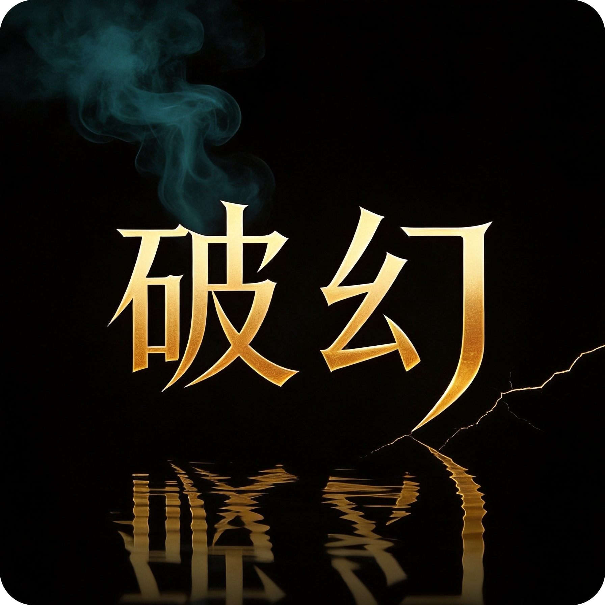
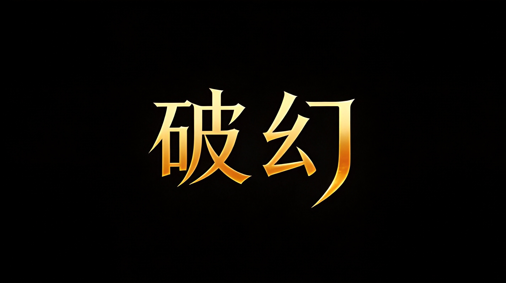

<p align="center">
  
  
  
</p>

<br/>

<p align="center">
  
</p>

# 破幻 Dispel — Relationship Control System Lens

> **看穿控制系统的结构化分析系统。不需要经历完整循环就能清醒。**
>
> **A structured analysis system for seeing through control systems. Clarity without having to live through the full cycle.**

---

<div align="center">
  
  <br>
  <sub><em>侧光穿透迷雾的那一刻，就是破幻 — The moment when light breaks through fog is called Dispel.</em></sub>
</div>

---

## 困境 / The Problem

在控制型关系中，最致命的事情从来不是伤害本身。是**看不见**。

当一个人还在问"对方是不是有问题"的时候，自尊已被系统性蚕食。当还在问"是不是我太敏感"的时候，经济、社会网络、自我判断力已被层层拆除。当终于确认"我该离开"的时候——已经被困在一个没有能力离开的系统里。

**大多数清醒来得太晚。不是因为被困的人不够聪明。是因为没有工具。**

传统建议能给出的一般是：
- "对方很坏，离开TA" — 但走不了，这句话变成了自我审判
- "你需要变强大" — 但不知道变强的第一步是什么
- "对方可能有人格障碍" — 标签能解释但不能改变任何事情

**需要的不是意见。需要的是一个分析框架——能让当事人自己看见系统如何运作。**

> Within a controlling relationship, the deadliest thing is never the harm itself. It's **not seeing clearly**. Most clarity arrives too late — not because the person trapped isn't smart enough, but because they didn't have the tools. What's needed is not advice — it's an analysis framework that lets people see for themselves how the system works.

---

## 系统能做什么 / What This System Delivers

| 传统方法 | 破幻系统 |
|---------|---------|
| "对方有问题"的道德判断 | 激励结构分析（为什么这样做对当事人有利） |
| "你要变强"的模糊鼓励 | 提问协议（Q1-Q17）帮用户发现自己的资源地图 |
| 混乱的同情 | 三层控制模型，把"不舒服"翻译成"被控制" |
| 破碎的走/留建议 | 退出可行性公式，提供量化真实评估 |
| "时间会治愈一切"的空话 | 可执行的行动框架（今天/本周/本月/无论何时） |

---

## 系统全景 / System at a Glance

六个核心输出维度，覆盖从"还在自我怀疑"到"知道该做什么"的完整路径。

<div style="padding: 8px 0;">
  <div style="display: grid; grid-template-columns: repeat(auto-fit, minmax(180px, 1fr)); gap: 10px;">

    <div style="background: #EEEDFE; border-radius: 10px; padding: 14px 16px;">
      <div style="font-size: 11px; font-weight: 500; color: #534AB7; margin-bottom: 6px; letter-spacing: .04em;">模式 A — 照妖镜</div>
      <div style="font-size: 13px; color: #26215C; font-weight: 500; margin-bottom: 4px;">看见行为 vs 话语</div>
      <div style="font-size: 12px; color: #534AB7; line-height: 1.5;">当你还在怀疑自己，把对方的「说」和「做」并列对照，不加评价</div>
    </div>

    <div style="background: #E1F5EE; border-radius: 10px; padding: 14px 16px;">
      <div style="font-size: 11px; font-weight: 500; color: #0F6E56; margin-bottom: 6px; letter-spacing: .04em;">模式 B — X光透视</div>
      <div style="font-size: 13px; color: #04342C; font-weight: 500; margin-bottom: 4px;">看清系统全局</div>
      <div style="font-size: 12px; color: #0F6E56; line-height: 1.5;">绘制所有节点与激励流向：谁在操纵什么、为什么困住</div>
    </div>

    <div style="background: #FAECE7; border-radius: 10px; padding: 14px 16px;">
      <div style="font-size: 11px; font-weight: 500; color: #993C1D; margin-bottom: 6px; letter-spacing: .04em;">模式 C — 清醒剂</div>
      <div style="font-size: 13px; color: #4A1B0C; font-weight: 500; margin-bottom: 4px;">击穿反复摇摆</div>
      <div style="font-size: 12px; color: #993C1D; line-height: 1.5;">当你知道全部事实却还在犹豫，直击不可回避的核心真相</div>
    </div>

    <div style="background: #FBEAF0; border-radius: 10px; padding: 14px 16px;">
      <div style="font-size: 11px; font-weight: 500; color: #993556; margin-bottom: 6px; letter-spacing: .04em;">退出可行性计算</div>
      <div style="font-size: 13px; color: #4B1528; font-weight: 500; margin-bottom: 4px;">量化你真实处境</div>
      <div style="font-size: 12px; color: #993556; line-height: 1.5;">经济/社会/心理/法律 四维打分，得出有数据支撑的行动建议</div>
    </div>

    <div style="background: #E6F1FB; border-radius: 10px; padding: 14px 16px;">
      <div style="font-size: 11px; font-weight: 500; color: #185FA5; margin-bottom: 6px; letter-spacing: .04em;">力量审计</div>
      <div style="font-size: 13px; color: #042C53; font-weight: 500; margin-bottom: 4px;">发现你已有的资产</div>
      <div style="font-size: 12px; color: #185FA5; line-height: 1.5;">在系统最坏处境里，识别你正在做的有效事——你不是从零开始</div>
    </div>

    <div style="background: #EAF3DE; border-radius: 10px; padding: 14px 16px;">
      <div style="font-size: 11px; font-weight: 500; color: #3B6D11; margin-bottom: 6px; letter-spacing: .04em;">行动框架</div>
      <div style="font-size: 13px; color: #173404; font-weight: 500; margin-bottom: 4px;">今天能做什么</div>
      <div style="font-size: 12px; color: #3B6D11; line-height: 1.5;">按安全风险高低输出今日/本周/本月的具体可执行清单</div>
    </div>

  </div>
</div>

---

## 核心框架 / Core Framework

### 退出不等式 / The Exit Inequality

控制者全部的操作，都在操纵这个不等式的两边：

```
留下的效用 = 已知的经济收益 + 社会身份 + "完整"的幻觉 + 间歇性温情 - 痛苦 - 恐惧
离开的效用 = 未知的自由 + 安全 + 自我尊重 - 不确定性 - 社会审判 - 报复风险
```

**只要离开的效用 < 留下的效用，就被困住。不需要锁链。** 这是第一性原理。所有控制手法——暴力、PUA、煤气灯、经济控制——都是在这个不等式的两边做文章。

---

### 三层控制模型 / Three-Layer Control Model

<svg viewBox="0 0 680 390" width="100%" role="img">
  <title>三层控制模型</title>
  <desc>从外到内三层嵌套：物理控制、社会控制、心理控制</desc>
  <defs>
    <style>
      .t { font-family: sans-serif; font-size: 14px; fill: #1a1a1a; }
      .ts { font-family: sans-serif; font-size: 12px; fill: #666; }
      .th { font-family: sans-serif; font-size: 14px; font-weight: 500; }
    </style>
  </defs>

  <text class="ts" x="40" y="30" font-size="11" font-weight="500" fill="#888" letter-spacing="0.06em">三层控制模型 / Three-Layer Control Model</text>

  <rect x="40" y="48" width="600" height="300" rx="20" fill="#FAECE7" stroke="#D85A30" stroke-width="0.5"/>
  <rect x="80" y="88" width="520" height="220" rx="16" fill="#FBEAF0" stroke="#D4537E" stroke-width="0.5"/>
  <rect x="120" y="128" width="440" height="140" rx="12" fill="#EEEDFE" stroke="#7F77DD" stroke-width="0.5"/>

  <text class="th" x="340" y="76" text-anchor="middle" fill="#993C1D" font-size="13">第一层：物理控制</text>
  <text class="ts" x="340" y="94" text-anchor="middle" fill="#D85A30">「不能走」— 最显眼，却只是入口</text>

  <text class="th" x="340" y="118" text-anchor="middle" fill="#993556" font-size="13">第二层：社会控制</text>
  <text class="ts" x="340" y="135" text-anchor="middle" fill="#D4537E">「没地方去」— 最常被合理化，最难打破</text>

  <text class="th" x="340" y="162" text-anchor="middle" fill="#534AB7" font-size="13">第三层：心理控制</text>
  <text class="ts" x="340" y="179" text-anchor="middle" fill="#7F77DD">「不想走」— 声音已住进大脑，最致命</text>

  <rect x="200" y="196" width="280" height="52" rx="10" fill="#EEEDFE" stroke="#7F77DD" stroke-width="0.5"/>
  <text class="th" x="340" y="218" text-anchor="middle" fill="#26215C" font-size="13">你</text>
  <text class="ts" x="340" y="235" text-anchor="middle" fill="#534AB7">活在系统内部，看不见系统边界</text>

  <text x="44" y="268" font-family="sans-serif" font-size="11" fill="#993C1D">经济切断</text>
  <text x="44" y="283" font-family="sans-serif" font-size="11" fill="#993C1D">人身限制</text>
  <text x="44" y="298" font-family="sans-serif" font-size="11" fill="#993C1D">跟踪监控</text>

  <text x="84" y="268" font-family="sans-serif" font-size="11" fill="#993556">家族协作</text>
  <text x="530" y="268" font-family="sans-serif" font-size="11" fill="#993556">外部共识</text>
  <text x="530" y="283" font-family="sans-serif" font-size="11" fill="#993556">社会孤立</text>
  <text x="530" y="298" font-family="sans-serif" font-size="11" fill="#993556">无处可去</text>

  <text class="ts" x="340" y="368" text-anchor="middle" fill="#888780">破幻首先诊断你被困在哪一层——再制定对应行动</text>
</svg>

**三层同时激活时，系统几乎不可能从内部打破。破幻首先诊断你被困在哪一层，再制定对应行动。**
当三层全部激活时，承控者的经济资源、社会支持、自我判断力被同时切断——这就是为什么"离开"不是一个简单的决定。

---

### 退出可行性 / Exit Feasibility Formula

<svg viewBox="0 0 680 340" width="100%" role="img">
  <title>退出可行性公式</title>
  <desc>退出可行性 = 四项资源评分之和 除以 安全风险，分为四个行动区间</desc>
  <defs>
    <style>
      .t  { font-family: sans-serif; font-size: 14px; fill: #1a1a1a; }
      .ts { font-family: sans-serif; font-size: 12px; fill: #666; }
      .th { font-family: sans-serif; font-size: 14px; font-weight: 500; }
    </style>
  </defs>

  <text font-family="sans-serif" font-size="11" font-weight="500" fill="#888" letter-spacing="0.06em" x="40" y="30">退出可行性公式 / Exit Feasibility Formula</text>

  <rect x="40" y="44" width="600" height="70" rx="12" fill="#F1EFE8" stroke="#B4B2A9" stroke-width="0.5"/>
  <text font-family="sans-serif" font-size="13" font-weight="500" fill="#2C2C2A" text-anchor="middle" x="340" y="70">退出可行性 = ( 经济独立 + 社会支持 + 心理独立 + 法律保护 ) ÷ 安全风险</text>
  <text font-family="sans-serif" font-size="11" fill="#5F5E5A" text-anchor="middle" x="340" y="96">每项 1–10 评分，安全风险底线为 1（非零）· 得分越高，行动条件越充分</text>

  <rect x="40" y="136" width="132" height="64" rx="10" fill="#FCEBEB" stroke="#E24B4A" stroke-width="0.5"/>
  <text font-family="sans-serif" font-size="22" font-weight="500" fill="#A32D2D" text-anchor="middle" x="106" y="162">&lt; 1</text>
  <text font-family="sans-serif" font-size="11" fill="#A32D2D" text-anchor="middle" x="106" y="178">先建立资产</text>
  <text font-family="sans-serif" font-size="11" fill="#5F5E5A" text-anchor="middle" x="106" y="192">安全/经济/社会基础为零</text>

  <rect x="188" y="136" width="132" height="64" rx="10" fill="#FAEEDA" stroke="#EF9F27" stroke-width="0.5"/>
  <text font-family="sans-serif" font-size="22" font-weight="500" fill="#854F0B" text-anchor="middle" x="254" y="162">1–1.5</text>
  <text font-family="sans-serif" font-size="11" fill="#854F0B" text-anchor="middle" x="254" y="178">条件在形成中</text>
  <text font-family="sans-serif" font-size="11" fill="#5F5E5A" text-anchor="middle" x="254" y="192">持续建立，关注缺口维度</text>

  <rect x="336" y="136" width="132" height="64" rx="10" fill="#E1F5EE" stroke="#1D9E75" stroke-width="0.5"/>
  <text font-family="sans-serif" font-size="22" font-weight="500" fill="#0F6E56" text-anchor="middle" x="402" y="162">1.5–2</text>
  <text font-family="sans-serif" font-size="11" fill="#0F6E56" text-anchor="middle" x="402" y="178">可以计划行动</text>
  <text font-family="sans-serif" font-size="11" fill="#5F5E5A" text-anchor="middle" x="402" y="192">制定具体时间线</text>

  <rect x="484" y="136" width="156" height="64" rx="10" fill="#E6F1FB" stroke="#378ADD" stroke-width="0.5"/>
  <text font-family="sans-serif" font-size="22" font-weight="500" fill="#185FA5" text-anchor="middle" x="562" y="162">&gt; 2</text>
  <text font-family="sans-serif" font-size="11" fill="#185FA5" text-anchor="middle" x="562" y="178">条件已具备</text>
  <text font-family="sans-serif" font-size="11" fill="#5F5E5A" text-anchor="middle" x="562" y="192">唯一阻碍是心理层——直面它</text>

  <line x1="40" y1="230" x2="640" y2="230" stroke="#D3D1C7" stroke-width="0.5"/>

  <text font-family="sans-serif" font-size="12" font-weight="500" fill="#2C2C2A" x="40" y="256">破幻做什么：</text>
  <text font-family="sans-serif" font-size="12" fill="#5F5E5A" x="40" y="274">1. 逐维度打分，找出最弱的那一项 — 那是最优先投入的方向</text>
  <text font-family="sans-serif" font-size="12" fill="#5F5E5A" x="40" y="292">2. 如果「数学上够了」但还是害怕 — 这说明有未被公式捕获的壁垒，继续追问</text>
  <text font-family="sans-serif" font-size="12" fill="#5F5E5A" x="40" y="310">3. 安全风险高于 6 → 暂停所有计划讨论，先做物理安全清单</text>
</svg>

---

### 十个角色模型 / Ten Character Models

功能化工具，不依赖性别、文化、身份。可出现在任何关系类型中——伴侣、家庭、职场、组织。

<svg viewBox="0 0 680 620" width="100%" role="img">
  <title>十个角色模型体系</title>
  <desc>围绕关系控制系统，十个功能化角色的作用</desc>
  <defs>
    <style>
      .tl { font-family: sans-serif; font-size: 11px; font-weight: 500; fill: #888; letter-spacing: 0.06em; }
    </style>
  </defs>

  <text class="tl" x="40" y="28">十角色模型 / Ten Character Models — 功能化分析工具，不依赖性别或身份</text>

  <!-- 中心：关系控制系统 -->
  <ellipse cx="340" cy="200" rx="58" ry="38" fill="#F1EFE8" stroke="#888780" stroke-width="0.5"/>
  <text font-family="sans-serif" font-size="12" font-weight="500" fill="#2C2C2A" text-anchor="middle" x="340" y="194">关系控制</text>
  <text font-family="sans-serif" font-size="12" font-weight="500" fill="#2C2C2A" text-anchor="middle" x="340" y="210">系统</text>

  <!-- 第1行：5个角色 -->
  <rect x="20" y="48" width="115" height="82" rx="10" fill="#FCEBEB" stroke="#E24B4A" stroke-width="0.5"/>
  <text font-family="sans-serif" font-size="11" font-weight="500" fill="#791F1F" x="30" y="68">自欺型操控者</text>
  <text font-family="sans-serif" font-size="9" fill="#5F5E5A" x="30" y="84">暴力与理智如何</text>
  <text font-family="sans-serif" font-size="9" fill="#5F5E5A" x="30" y="98">在一人身上并存</text>
  <text font-family="sans-serif" font-size="9" fill="#5F5E5A" x="30" y="116">为何永不认错</text>

  <rect x="152" y="48" width="115" height="82" rx="10" fill="#FAEEDA" stroke="#EF9F27" stroke-width="0.5"/>
  <text font-family="sans-serif" font-size="11" font-weight="500" fill="#633806" x="162" y="68">循环源代码</text>
  <text font-family="sans-serif" font-size="9" fill="#5F5E5A" x="162" y="84">谁制造了操控者</text>
  <text font-family="sans-serif" font-size="9" fill="#5F5E5A" x="162" y="98">暴力如何跨代</text>
  <text font-family="sans-serif" font-size="9" fill="#5F5E5A" x="162" y="116">复制</text>

  <rect x="283" y="48" width="115" height="82" rx="10" fill="#EEEDFE" stroke="#7F77DD" stroke-width="0.5"/>
  <text font-family="sans-serif" font-size="11" font-weight="500" fill="#26215C" x="293" y="68">被征用的美德</text>
  <text font-family="sans-serif" font-size="9" fill="#5F5E5A" x="293" y="84">最好的人为何</text>
  <text font-family="sans-serif" font-size="9" fill="#5F5E5A" x="293" y="98">被困最久</text>
  <text font-family="sans-serif" font-size="9" fill="#5F5E5A" x="293" y="116">善良如何变成锁链</text>

  <rect x="414" y="48" width="115" height="82" rx="10" fill="#E1F5EE" stroke="#1D9E75" stroke-width="0.5"/>
  <text font-family="sans-serif" font-size="11" font-weight="500" fill="#04342C" x="424" y="68">系统协作者</text>
  <text font-family="sans-serif" font-size="9" fill="#5F5E5A" x="424" y="84">看似站你这边</text>
  <text font-family="sans-serif" font-size="9" fill="#5F5E5A" x="424" y="98">为何加固了</text>
  <text font-family="sans-serif" font-size="9" fill="#5F5E5A" x="424" y="116">系统</text>

  <rect x="546" y="48" width="115" height="82" rx="10" fill="#E6F1FB" stroke="#378ADD" stroke-width="0.5"/>
  <text font-family="sans-serif" font-size="11" font-weight="500" fill="#042C53" x="556" y="68">控制介质</text>
  <text font-family="sans-serif" font-size="9" fill="#5F5E5A" x="556" y="84">关系切断后</text>
  <text font-family="sans-serif" font-size="9" fill="#5F5E5A" x="556" y="98">控制如何通过</text>
  <text font-family="sans-serif" font-size="9" fill="#5F5E5A" x="556" y="116">第三方继续穿透</text>

  <!-- 连接线 第1行 → 中心 -->
  <line x1="77" y1="130" x2="290" y2="170" stroke="#E24B4A" stroke-width="0.5" stroke-dasharray="4,3"/>
  <line x1="210" y1="130" x2="310" y2="170" stroke="#EF9F27" stroke-width="0.5" stroke-dasharray="4,3"/>
  <line x1="340" y1="130" x2="340" y2="162" stroke="#7F77DD" stroke-width="0.5" stroke-dasharray="4,3"/>
  <line x1="472" y1="130" x2="370" y2="170" stroke="#1D9E75" stroke-width="0.5" stroke-dasharray="4,3"/>
  <line x1="604" y1="130" x2="390" y2="170" stroke="#378ADD" stroke-width="0.5" stroke-dasharray="4,3"/>

  <!-- 第2行：5个角色 -->
  <rect x="20" y="280" width="115" height="82" rx="10" fill="#F5F0E6" stroke="#C4A97D" stroke-width="0.5"/>
  <text font-family="sans-serif" font-size="11" font-weight="500" fill="#6B4F2A" x="30" y="300">控制惯性</text>
  <text font-family="sans-serif" font-size="9" fill="#5F5E5A" x="30" y="316">关系结束了系统</text>
  <text font-family="sans-serif" font-size="9" fill="#5F5E5A" x="30" y="330">为何还在自动</text>
  <text font-family="sans-serif" font-size="9" fill="#5F5E5A" x="30" y="348">运行</text>

  <rect x="152" y="280" width="115" height="82" rx="10" fill="#E8E2F5" stroke="#9B7FD4" stroke-width="0.5"/>
  <text font-family="sans-serif" font-size="11" font-weight="500" fill="#46307A" x="162" y="300">自断后路</text>
  <text font-family="sans-serif" font-size="9" fill="#5F5E5A" x="162" y="316">真正堵路的人</text>
  <text font-family="sans-serif" font-size="9" fill="#5F5E5A" x="162" y="330">是谁</text>
  <text font-family="sans-serif" font-size="9" fill="#5F5E5A" x="162" y="348"></text>

  <rect x="283" y="280" width="115" height="82" rx="10" fill="#FDE8E8" stroke="#E67373" stroke-width="0.5"/>
  <text font-family="sans-serif" font-size="11" font-weight="500" fill="#8B2222" x="293" y="300">误判系统</text>
  <text font-family="sans-serif" font-size="9" fill="#5F5E5A" x="293" y="316">每个错误决定</text>
  <text font-family="sans-serif" font-size="9" fill="#5F5E5A" x="293" y="330">背后的因果链</text>
  <text font-family="sans-serif" font-size="9" fill="#5F5E5A" x="293" y="348">是什么</text>

  <rect x="414" y="280" width="115" height="82" rx="10" fill="#FFF2D6" stroke="#E8B84B" stroke-width="0.5"/>
  <text font-family="sans-serif" font-size="11" font-weight="500" fill="#7A5E1A" x="424" y="300">弱点雷达</text>
  <text font-family="sans-serif" font-size="9" fill="#5F5E5A" x="424" y="316">你以为是性格的</text>
  <text font-family="sans-serif" font-size="9" fill="#5F5E5A" x="424" y="330">什么是被制造的</text>
  <text font-family="sans-serif" font-size="9" fill="#5F5E5A" x="424" y="348">弱点</text>

  <rect x="546" y="280" width="115" height="82" rx="10" fill="#DCFCE7" stroke="#22C55E" stroke-width="0.5"/>
  <text font-family="sans-serif" font-size="11" font-weight="500" fill="#166534" x="556" y="300">内核闪光</text>
  <text font-family="sans-serif" font-size="9" fill="#5F5E5A" x="556" y="316">有什么在你体内</text>
  <text font-family="sans-serif" font-size="9" fill="#5F5E5A" x="556" y="330">是任何系统都</text>
  <text font-family="sans-serif" font-size="9" fill="#5F5E5A" x="556" y="348">无法摧毁的</text>

  <!-- 连接线 第2行 → 中心 -->
  <line x1="77" y1="280" x2="290" y2="228" stroke="#C4A97D" stroke-width="0.5" stroke-dasharray="4,3"/>
  <line x1="210" y1="280" x2="310" y2="228" stroke="#9B7FD4" stroke-width="0.5" stroke-dasharray="4,3"/>
  <line x1="340" y1="280" x2="340" y2="238" stroke="#E67373" stroke-width="0.5" stroke-dasharray="4,3"/>
  <line x1="472" y1="280" x2="370" y2="228" stroke="#E8B84B" stroke-width="0.5" stroke-dasharray="4,3"/>
  <line x1="604" y1="280" x2="390" y2="228" stroke="#22C55E" stroke-width="0.5" stroke-dasharray="4,3"/>

  <text font-family="sans-serif" font-size="10" fill="#888780" text-anchor="middle" x="340" y="400">十个角色围绕「关系控制系统」。每个都是独立可用的功能化分析工具。</text>
</svg>

| # | 角色 | 核心问题 | 揭示什么 |
|---|------|---------|---------|
| 1 | **自欺型操控者** | 暴力与理智如何在一人身上并存？ | 先骗自己再骗世界的闭合逻辑——为何永不认错 |
| 2 | **循环源代码** | 谁制造了操控者？ | 暴力跨代复制的机制 |
| 3 | **被征用的美德** | 最好的人为何被困最久？ | 共情/善良/希望如何被转化为控制工具 |
| 4 | **系统协作者** | 看似站你这边的人，为何加固了系统？ | 旁观者/亲属/调解者的真实激励结构 |
| 5 | **控制介质** | 关系切断后，控制如何继续穿透？ | 通过孩子/财产/第三方的延续控制 |
| 6 | **控制惯性** | 关系结束了，系统为何还在自动运行？ | 机器的五层架构、能量源、销毁协议 |
| 7 | **自断后路** | 真正堵路的人是谁？ | 承控者如何亲手拆除自己的退路 |
| 8 | **误判系统** | 每个错误决定背后的因果链是什么？ | 10个关键误判的心理学机制与后果 |
| 9 | **弱点雷达** | 你以为是性格的——什么是被制造出来的弱点？ | 八种核心弱点的形成与修复 |
| 10 | **内核闪光** | 有什么在你体内是任何系统都无法摧毁的？ | 不可剥夺的核心本质与延展路径 |

---

### 控制惯性层 / Control Inertia Layer

关系形式的结束不等于控制的结束。当三层控制全部建立且关系解体后，一个独立的惯性层开始运作——这台机器由承控者自身的美德驱动，即使施加者不再主动操作，系统仍然自动运行。

<div align="center">
  
  <br/>
  <sub><em>控制惯性五层架构 — 关系结束后系统为何仍自动运行 / Why the system keeps running after the relationship ends</em></sub>
</div>

---

## 差异化 / What Makes This Different

### 1. 基于第一性原理，不是情感建议
大多数分析框架建立在"谁对谁错"的道德判断上。这套系统建立在几个不可辩驳的底层原理上：
- **退出不等式** — 留/开的效用计算
- **行为 vs 话语的严格分离** — 话语权重低于行为 100 倍
- **激励结构分析** — "告诉我激励，我告诉你结果"
- **量化公式** — 退出可行性 = 四项资源 ÷ 安全风险

### 2. 不是给答案，是给框架
传统建议说"你应该离开"——用户收到的是结论，不是工具。这套系统给的是：17个结构化问题、5步分析协议、自我评估维度、行动优先级框架。**用户学会了这个框架，就再也不会被困住。**

### 3. 角色模型独立于性别、文化、身份
十个角色模型不依赖"丈夫/妻子/婆婆"这类社会角色。它们可以出现在任何关系类型中——伴侣、家庭、职场、组织。跨文化、跨场景适用。

### 4. 从真实故事蒸馏出通用模型
参数不是来自理论推演，是来自真实经历中的行为模式反复提取。经过匿名化、一般化处理后形成功能化的分析工具。**每一行代码都有真实的根基。**

### 5. 安全先于分析
内置安全边界（危险信号触发器 + 数字安全提示）。分析开始前必须先确保安全。没有哪个分析比安全更重要。

### 6. 中英双语同行
所有技能文件是中英双语交错编写，全球用户可用同一份文档获取同等质量的分析。

---

## 技能体系 / Skill System

```
skills/
├── 📐 dispel.md                        主分析引擎（安全边界 + 17问协议 + 5步分析 + 3种输出模式）
├── 🎭 self-deceiving-controller.md    自欺型操控者模型
├── 🧬 cycle-originator.md             循环源代码模型
├── 🎯 weaponized-virtue.md            被征用的美德模型
├── 🔗 system-collaborator.md          系统协作者模型
├── 🩸 control-conduit.md              控制介质模型
├── ⚙️  control-inertia.md             控制惯性层模型
├── 🧱 self-barricade.md               自断后路模型
├── 🎯 decision-blindness.md           误判系统模型
├── 📡 vulnerability-radar.md          弱点雷达模型
└── ✨ inner-radiance.md               内核闪光模型
```

### 各模型适用场景

| 当你... | 可以看 |
|---------|--------|
| 刚接触，想整体理解这段关系 | `dispel.md`（主引擎） |
| 对方做了伤害的事却不觉得自己有问题 | `self-deceiving-controller.md` |
| 想知道对方为什么会变成这样 | `cycle-originator.md` |
| 你最善良的品质被反复利用 | `weaponized-virtue.md` |
| 周围人都在劝你忍 | `system-collaborator.md` |
| 离婚/分手后还被搅在关系里 | `control-conduit.md` |
| 结束了，却发现自己走不出来 | `control-inertia.md` |
| 觉得"没有人会帮我" | `self-barricade.md` |
| 反复犯同样的错，后悔不已 | `decision-blindness.md` |
| 感觉自己全身都是弱点 | `vulnerability-radar.md` |
| 想知道自己还有什么价值 | `inner-radiance.md` |

---

## 使用方法 / How to Use

This system is built as a Claude Code skill set:

1. 将 `.md` 文件放入 `.claude/skills/` 目录 / Place files in your `.claude/skills/` directory
2. 输入 `/dispel` 或在对话中描述你遇到的困惑 / Invoke with `/dispel` or via trigger words
3. 每个技能可独立使用，也可作为完整分析流程的一部分 / Each skill is independent or part of the pipeline

**快速扫描（2 分钟）/ Quick scan：** Q1（具体行为）+ Q6（经济独立）+ Q9（过去尝试）→ 得到初步方向

**完整分析 / Full analysis：** 17 个问题 × 4 个层级 → 5 步分析协议 → 照妖镜/X光/清醒剂三种输出模式

---

## 长期价值 / Long-Term Value

### 对个人用户
- **第一次使用：** 识别一段关系的结构和你的退出壁垒
- **第二次使用：** 分析为什么离开后又动摇
- **第三次使用：** 识别早期信号——在退出成本最低的时候做出判断
- **无限次使用：** 保护好身边的人——帮他们看见他们看不见的东西

### 对专业人士（心理咨询师 / 社工 / 律师）
- 结构化、可复用的分析框架来理解客户处境
- 退出可行性公式为决策提供数据支撑
- 行动框架为客户提供"接下来做什么"的具体路径

### 对社区组织 / 庇护所
- 资源审计框架帮助工作人员快速评估来访者处境
- 安全边界帮助一线人员及时识别致命风险
- 可传播的原则库可用于公众教育

---

## 来源 / Origin

*Models distilled from real stories. This is not academic theory — it is pattern recognition from experience, anonymized and generalized.*

---

## 协议 / License

MIT · Free to use, fork, improve.

This system's value is measured not by how many people download it, but by how many people it helps see clearly **one day earlier**.

<p align="center">
  <sub>Made with clarity by <a href="https://github.com/web-seeker">web-seeker</a></sub>
</p>
